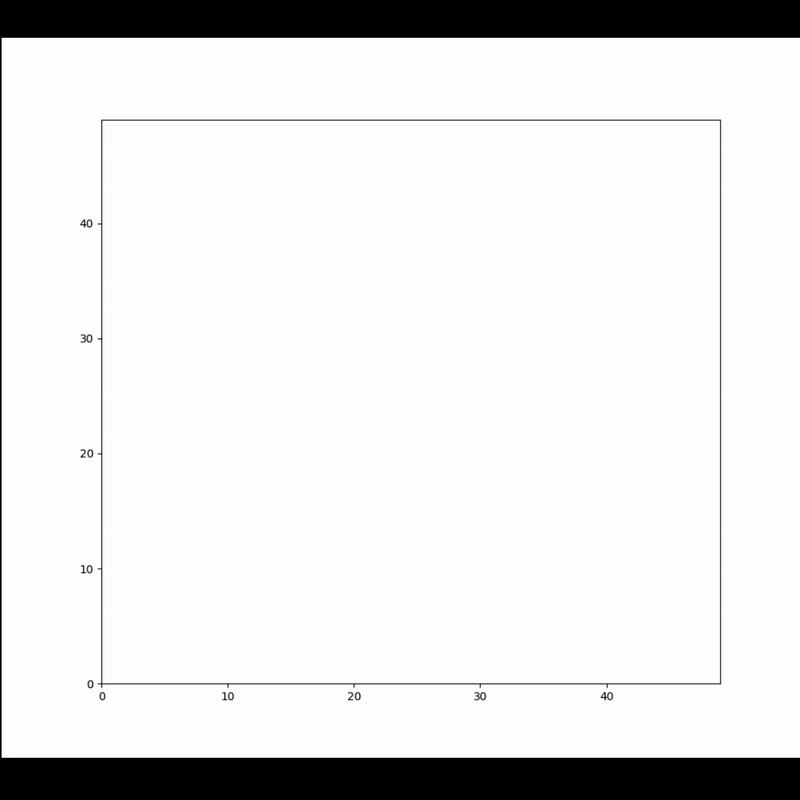

# Simulación de Drones

Este proyecto simula el movimiento de drones en un mapa de 50x50, evitando obstáculos y amenazas móviles, utilizando el algoritmo A* para encontrar rutas óptimas. El objetivo es que los drones alcancen sus metas designadas con restricciones de combustible.

## Objetivos cumplidos

- Múltiples drones: La simulación soporta varios drones simultáneamente.
- Amenazas móviles: Las amenazas se mueven aleatoriamente cada cierto tiempo, afectando las rutas de los drones.
- Restricciones de combustible: Cada dron tiene un límite de combustible que afecta su capacidad para alcanzar el objetivo.
- Visualización interactiva: La simulación se visualiza en tiempo real con Matplotlib, mostrando el mapa, los drones, sus rutas y las amenazas.

## Requisitos

- `Python 3.8+`
- Dependencias: numpy, pandas, matplotlib, osmnx, geopandas, shapely, pyosmium

## Instalación

1. Clona el repositorio:
`git clone https://github.com/jamesyul/Dronewin.git`
2. Ingresa a tu repositorio:
`cd Dronewin`
3. Instala las dependencias:
`pip install -r requirements.txt`
4. Asegúrate de que los archivos data/mapas/Mapa_de_Kursk.pbf, data/mapas/mapa_inicial.csv y data/amenazas/amenazas_iniciales.csv estén en su lugar.

## Ejecución

1. Ejecuta el script principal:
`python src/simulation.py`
2. Sigue las instrucciones en la consola para ingresar el número de drones, sus posiciones iniciales, objetivos y combustible.

## Demostración
A continuación, un video que muestra cómo funciona la simulación con las siguientes coordenadas para el Drone 1:

Coordenada inicial: (35, 15)
Coordenada objetivo: (26, 0)
Combustible inicial: 100

## Estructura del proyecto

- data/mapas/Mapa_de_Kursk.pbf: Archivo PBF de OpenStreetMap para Kursk.
- data/mapas/mapa_inicial.csv: Cuadrícula de 50x50 generada a partir del PBF, con obstáculos.
- data/amenazas/amenazas_iniciales.csv: Posiciones iniciales de las amenazas (con tipo y rango).
- src/: Código fuente:
- utils/grid.py: Funciones para cargar y verificar el mapa.
- utils/visualization.py: Visualización interactiva con Matplotlib.
- algorithms/pathfinding.py: Implementación del algoritmo A* con costos por amenazas.
- models/drone.py: Clase para los drones.
- models/threat.py: Clase para las amenazas.
- simulation.py: Script principal para ejecutar la simulación.

## Resultados

La simulación muestra el mapa, los drones y las amenazas en tiempo real.
Los drones evitan obstáculos y recalculan rutas cuando las amenazas se mueven.
Al finalizar, se genera resultados_simulacion.txt con el estado de cada dron y su historial de posiciones.

